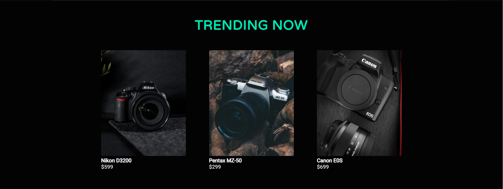
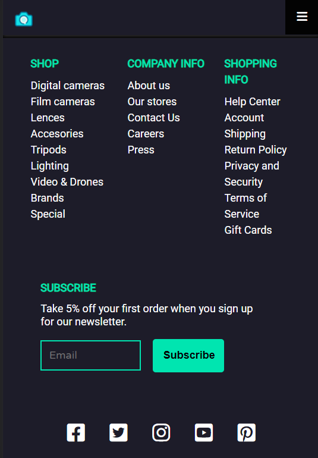

## 🛍️ Proyecto: Manejo y Configuración de Software (Parcial 1)

### 📖 Descripción

Este proyecto consiste en un **sitio web de e-commerce** desarrollado con **HTML5, SCSS y JavaScript**, enfocado en simular una tienda online moderna y responsiva.

Incluye funcionalidades como:

* Visualización de productos 🛒
* Carrito de compras 🧺
* Proceso de checkout 💳
* Formulario de contacto 📩
* Productos con variaciones de color mediante imágenes 🎨

---

### 🎯 Objetivos

* 💻 Desarrollar una interfaz atractiva y funcional
* 🖼️ Implementar productos con variantes visuales (colores)
* 🛒 Simular un sistema básico de carrito de compras
* 📬 Crear un formulario de contacto funcional (simulado)
* 📱 Garantizar diseño responsivo en múltiples dispositivos

---

### 🧩 Estructura del Proyecto

| Carpeta / Archivo | Descripción                       |
| ----------------- | --------------------------------- |
| `/css/`           | Estilos CSS 🎨                    |
| `/scss/`          | Archivos fuente SCSS 💅           |
| `/js/`            | Scripts JavaScript ⚙️             |
| `/img/`           | Imágenes de productos 📸          |
| `/lib/`           | Librerías externas 📚             |
| `/mail/`          | Simulación de envío de correos ✉️ |
| `index.html`      | Página principal 🏠               |
| `shop.html`       | Página de tienda 🛍️              |
| `cart.html`       | Carrito de compras 🛒             |
| `checkout.html`   | Proceso de pago 💳                |
| `detail.html`     | Detalles del producto 🔍          |
| `contact.html`    | Página de contacto 📞             |
| `.gitignore`      | Archivos ignorados 🚫             |
| `README.md`       | Documentación del proyecto 📘     |

---

### ⚙️ Instalación y Configuración

#### 🔧 Requisitos

* 🌐 Navegador web moderno (Chrome, Edge, Firefox, etc.)
* 🧠 Editor de código (recomendado: VS Code)
* 🧰 Git instalado

#### 🚀 Pasos

```bash
git clone https://github.com/zamukay/Proyecto1.git
cd Proyecto1
```

Luego abre:

```bash
index.html
```

en tu navegador.

---

### 💡 Uso del Proyecto

* 🛍️ Explora productos en `shop.html`
* 🛒 Añade productos en `cart.html`
* 💳 Simula una compra en `checkout.html`
* 🔍 Revisa detalles en `detail.html`
* 📩 Usa el formulario en `contact.html`

---

### 🖥️ Vista del Proyecto

#### 🌐 Versión Web




---

#### 📱 Versión Mobile

  
  

---

### 🧑‍💻 Contribuciones

Este proyecto es colaborativo. Para contribuir:

1. Crea una rama con Git Flow:

```bash
git flow feature start nombre-feature
```

2. Realiza tus cambios y haz commit
3. Finaliza la feature:

```bash
git flow feature finish nombre-feature
```

---

### 🐞 Soporte

Si encuentras errores:

* 📌 Abre un issue en GitHub

---

### 🙌 Créditos

Proyecto académico desarrollado para la materia de
**Manejo y Configuración de Software**

---

### ⭐ Nota

Este proyecto es una **simulación académica**, no incluye pagos reales ni backend funcional.
