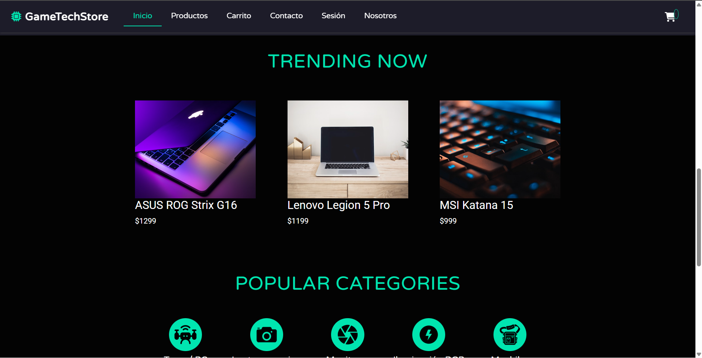
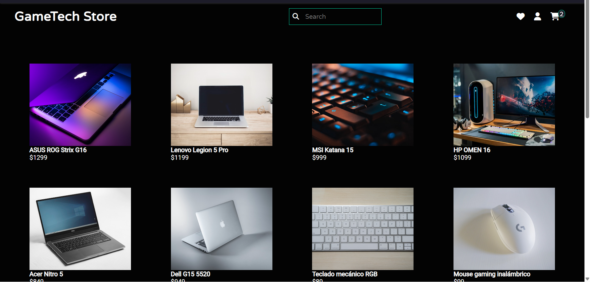
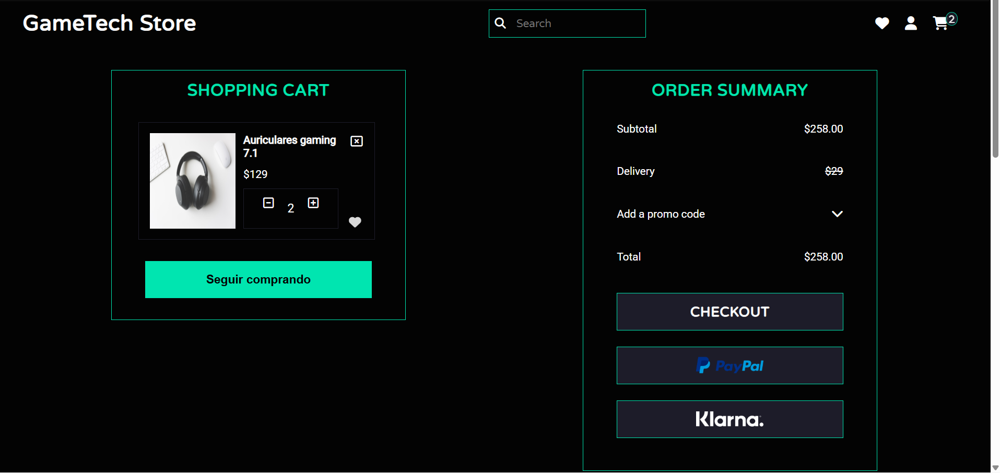
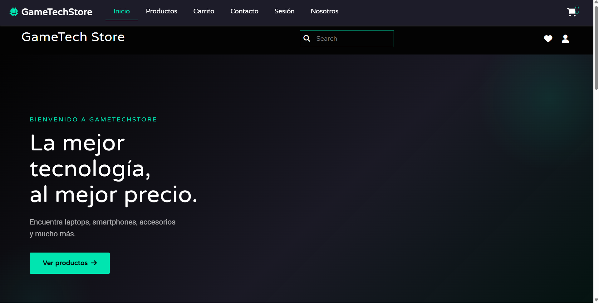
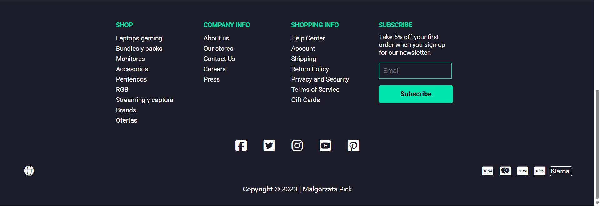

# 🛒 GameTech Store

### 📚 Proyecto: Manejo y Configuración de Software

---

## 📖 Descripción

Este proyecto consiste en un **e-commerce web moderno**, desarrollado inicialmente con **HTML5, SCSS y JavaScript**, y actualmente evolucionando hacia una arquitectura completa con **Backend en C# Web API**.

El sistema simula una tienda online y actualmente está evolucionando hacia un sistema real con integración de backend y base de datos.
---

## 🚀 Funcionalidades

### 🎨 Frontend

* 🛍️ Visualización de productos
* 🛒 Carrito de compras dinámico
* 💳 Proceso de checkout
* 📩 Formulario de contacto
* 🎨 Productos con variaciones visuales
* 📱 Diseño responsive
* ✨ Animaciones e interfaz moderna

---

### ⚙️ Backend (En desarrollo)

* 🔐 Registro e inicio de sesión
* 🔑 Autenticación con JWT
* 📦 API REST para gestión de productos
* 🧾 Gestión de órdenes
* 📩 Almacenamiento de mensajes de contacto
* 🗄️ Base de datos relacional (SQL Server)

---

## 🏗️ Arquitectura del Proyecto

### Frontend

* HTML5
* SCSS / CSS3
* JavaScript
* Bootstrap 5

### Backend

* C# (ASP.NET Core Web API)
* Entity Framework Core (Code First)

---

## 🗄️ Base de Datos

Tablas principales:

* Products
* Users
* Orders
* OrderItems
* ContactMessages

---

## 🌿 Flujo de Trabajo (Git Flow)

El proyecto sigue la metodología **Git Flow**:

* `main` → Producción
* `develop` → Integración
* `feature/*` → Nuevas funcionalidades

### 🔧 Ramas destacadas

#### Backend

* `feature/api-core-setup`

#### Frontend

* `feature/header-hero`
* `feature/why-us-animations`
* `feature/ajustes-visuales-catalogo`
* `feature/mejoras-interfaz-carrito`

#### Funcionalidades

* `feature/catalogo-productos`
* `feature/fix-catalogos-productos`
* `feature/detalle-carrito`
* `feature/checkout-footer`
* `feature/confirmation-footer`

#### Usuario y contacto

* `feature/login-ui`
* `feature/contacto`
* `feature/contacto-quienes-somos`
* `feature/contacto-funcionalidad`

---

## 🧩 Estructura del Proyecto

| Carpeta / Archivo    | Descripción           |
| -------------------- | --------------------- |
| `/css/`              | Estilos CSS           |
| `/scss/`             | Estilos SCSS          |
| `/js/`               | Scripts JS            |
| `/img/`              | Imágenes              |
| `/lib/`              | Librerías             |
| `/mail/`             | Simulación de correos |
| `index.html`         | Página principal      |
| `products.html`      | Catálogo              |
| `shopping-cart.html` | Carrito               |
| `checkout.html`      | Checkout              |
| `detalle.html`       | Detalle producto      |
| `contacto.html`      | Contacto              |

---

## ⚙️ Instalación y Uso

### 🔧 Requisitos

* Navegador moderno
* VS Code
* Git

---

### 🚀 Frontend

```bash
git clone https://github.com/zamukay/ProyectoMyCS.git
cd ProyectoMyCS
```

Abrir:

```bash
index.html
```

---

### ⚙️ Backend (Próximamente)

1. Abrir en Visual Studio
2. Configurar conexión
3. Ejecutar migraciones:

```bash
update-database
```

4. Ejecutar API

---

## 📡 Endpoints (API)

### Auth

* POST `/api/auth/register`
* POST `/api/auth/login`

### Productos

* GET `/api/products`
* GET `/api/products/{id}`

### Órdenes

* POST `/api/orders`

### Contacto

* POST `/api/contact`

---

## 🖥️ Vista del Proyecto

### 🌐 Web





---

### 📱 Mobile

  
  

---

## 🧑‍💻 Contribución

1. Crear rama:

```bash
git flow feature start nombre-feature
```

2. Realizar cambios
3. Finalizar:

```bash
git flow feature finish nombre-feature
```

---

## 📌 Estado del Proyecto

🚧 En desarrollo

✔ Frontend funcional
🔄 Integración con API en progreso
🚧 Backend en desarrollo (API REST en C#)
🔐 Implementación de autenticación con JWT en progreso
🗄️ Integración con base de datos en proceso

---

## 🙌 Créditos

Proyecto académico para la materia:

**Manejo y Configuración de Software**

---

## ⭐ Nota

Este proyecto evolucionó de una simulación frontend a una arquitectura completa con backend y base de datos.
